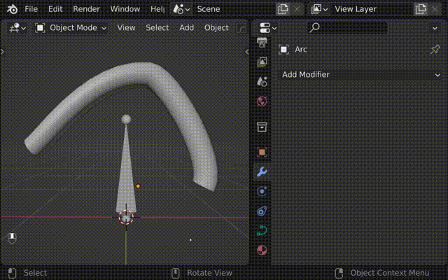

# Curve Bone Binder (Hook to new bones)

Adds bones to the selected curve control points, and binds them with Hook modifier.

Requirements
----

* Blender >= 3.0

Installation
----

1. Download ZIP package.
2. In Blender, install via **"Edit > Preferences... > Add-ons > Install..."**
3. Enable the add-on.

Usage
----

1. Select Armature object
2. Hold down `SHIFT` and select Curve object
3. Press `TAB` to enter Edit mode
4. Select the control point(s)
5. Press `Ctrl+H` -> Click "Hook to new bones"
    - Or `F3 > Bind`
